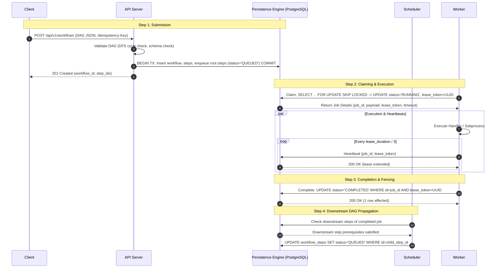
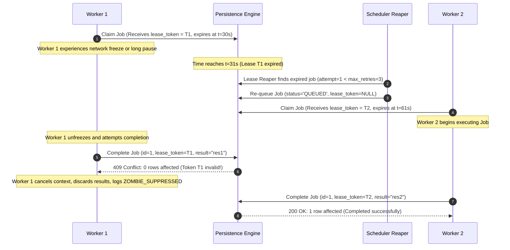

# System Architecture: Distributed Durable Workflow & Job Engine

## 1. High-Level Architecture Topology

```
                              ┌───────────────────────────────────┐
                              │            Clients                │
                              │   Web UI / CLI / SDK / cURL       │
                              └─────────────────┬─────────────────┘
                                                │ HTTPS / REST
                                                ▼
                              ┌───────────────────────────────────┐
                              │            API Tier               │
                              │  - AuthN / AuthZ (RBAC)           │
                              │  - Input / DAG Validation         │
                              │  - Idempotency Gatekeeper         │
                              │  - Job & Workflow Submission      │
                              └─────────────────┬─────────────────┘
                                                │
                 ┌──────────────────────────────┼──────────────────────────────┐
                 │                              │                              │
                 ▼                              ▼                              ▼
    ┌─────────────────────────┐    ┌─────────────────────────┐    ┌─────────────────────────┐
    │     Scheduler Node 1    │    │     Scheduler Node 2    │    │     Scheduler Node N    │
    │  - Workflow DAG Walker  │    │  - Workflow DAG Walker  │    │  - Workflow DAG Walker  │
    │  - Delayed Job Sweeper  │    │  - Delayed Job Sweeper  │    │  - Delayed Job Sweeper  │
    │  - Lease Reaper         │    │  - Lease Reaper         │    │  - Lease Reaper         │
    │  - Leaderless or Elect  │    │  - Leaderless or Elect  │    │  - Leaderless or Elect  │
    └────────────┬────────────┘    └────────────┬────────────┘    └────────────┬────────────┘
                 │                              │                              │
                 └──────────────────────────────┼──────────────────────────────┘
                                                │
                                                ▼
                              ┌───────────────────────────────────┐
                              │     Unified Persistence Engine    │
                              │     PostgreSQL (Production)       │
                              │     or SQLite WAL (Embedded)      │
                              │                                   │
                              │  - State Machine Store            │
                              │  - Queue (FOR UPDATE SKIP LOCKED) │
                              │  - Audit & Execution Logs         │
                              └─────────────────┬─────────────────┘
                                                │
                 ┌──────────────────────────────┼──────────────────────────────┐
                 │                              │                              │
                 ▼                              ▼                              ▼
    ┌─────────────────────────┐    ┌─────────────────────────┐    ┌─────────────────────────┐
    │      Worker Node 1      │    │      Worker Node 2      │    │      Worker Node N      │
    │  - Claim Loop           │    │  - Claim Loop           │    │  - Claim Loop           │
    │  - Heartbeat Goroutine  │    │  - Heartbeat Goroutine  │    │  - Heartbeat Goroutine  │
    │  - Task Execution Pool  │    │  - Task Execution Pool  │    │  - Task Execution Pool  │
    │  - Isolation / Cgroups  │    │  - Isolation / Cgroups  │    │  - Isolation / Cgroups  │
    └─────────────────────────┘    └─────────────────────────┘    └─────────────────────────┘
```

---

## 2. Core Components and Boundary Responsibilities

| Component | Primary Responsibility | State Owned | Downstream Dependencies | Failure Mode |
|---|---|---|---|---|
| **API Server** | HTTP ingress, API key authentication, tenant isolation, request validation, DAG cycle detection, idempotency deduplication. | Stateless (ephemeral connection pools). | Persistence Engine. | Horizontal scale; safe to restart at any time. Client retries with `Idempotency-Key`. |
| **Scheduler** | - Evaluates DAG dependencies when steps complete.<br>- Promotes delayed jobs (`run_at <= NOW()`).<br>- Reaps expired worker leases (re-queue or mark failed). | Stateless / DB-coordinated. Multiple schedulers can run concurrently using DB row locks. | Persistence Engine. | If a scheduler node crashes, peer schedulers continue sweeping. Sweeper queries use `SKIP LOCKED` preventing double-evaluation. |
| **Persistence Engine** | Single source of truth for jobs, workflows, queue records, execution audits, and tenant quotas. | Relational tables, indexes, ACID transactions. | Underlying persistent storage / disk. | Handled via PostgreSQL failover/replica or WAL journal. DB transient errors trigger client/worker exponential backoff. |
| **Worker Engine** | - Polls/claims runnable tasks via atomic lease reservation.<br>- Spawns isolated execution contexts (Go functions or sanitized subprocesses).<br>- Periodically renews leases via heartbeat.<br>- Acknowledges completion or failure with fencing lease tokens. | Local execution contexts, running process PIDs, active cancel funcs. | API / Persistence Engine. | Worker crash -> lease expires in DB -> Lease Reaper reclaims and re-queues task. Zombie worker completion rejected via lease fencing. |
| **CLI / Client SDK** | Submits workflows, inspects DAG execution graphs, monitors queue depths, cancels jobs, tails execution logs. | Stateless client configuration (API endpoint, API key). | API Server. | Network disconnect -> client retries idempotently. |

---

## 3. End-to-End Execution Data Flow



---

## 4. Lease Fencing & Zombie Worker Prevention



---

## 5. Deployment Topologies

### 5.1 Single-Binary Local / Embedded Development
In local development, embedded deployments, or lightweight CI test suites:
- The entire stack compiles into a single executable `jobengine`.
- Subcommands: `jobengine server --embedded-db` runs API, Scheduler, and embedded Worker pool in a single process using SQLite WAL mode.
- Requires zero external infrastructure, zero Docker daemon, and boots in <100ms.

### 5.2 Clustered Production Architecture
In production environments:
- **API Nodes**: Scaled horizontally behind an L7 Load Balancer (AWS ALB, NGINX, Envoy).
- **Scheduler Nodes**: 2 to 3 redundant scheduler instances running continuous reconciliation loops (`SKIP LOCKED` ensures no split-brain work duplication).
- **Worker Pools**: Auto-scaled worker groups segregated by queue:
  - Default CPU pool
  - High-Memory pool
  - Isolated Subprocess / I/O pool
- **Database**: Managed PostgreSQL cluster (Primary with streaming replication hot standby and automated WAL archiving).
